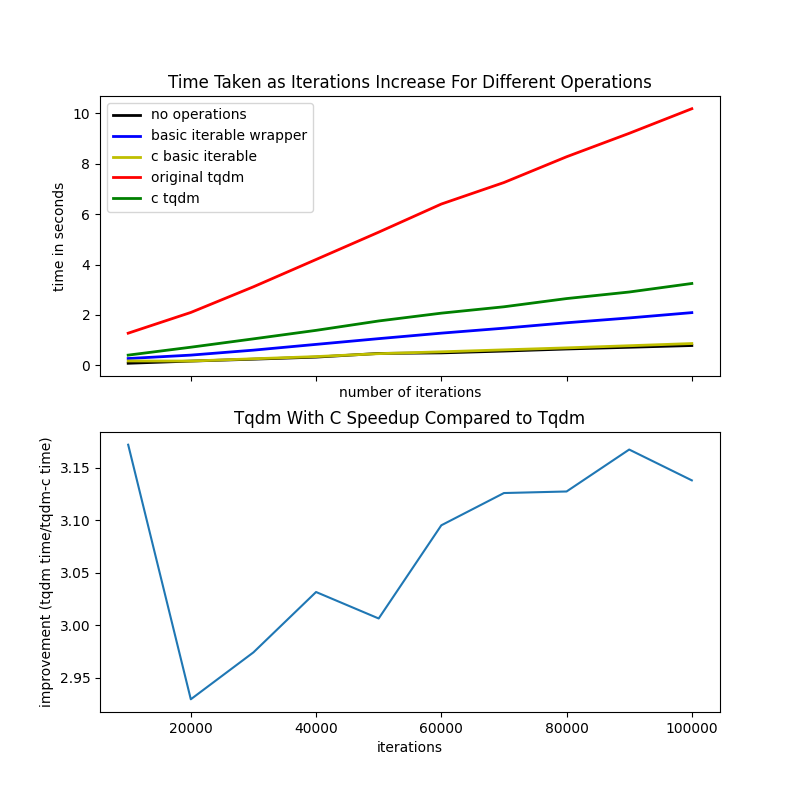

# tqdm-c

A rewrite of tqdm as a CPython C extension.

## Running

1. Create a fresh `venv`
2. Install `tqdm` with `pip install tqdm`
3. Install `matplotlib` with `python3 -m pip install matplotlib`
4. If on linux, then it might be necessary to install a gui backend for plt.show() to function. Do so with `sudo apt-get install python3-tk`
5. Build the C-extension with `python setup.py build`
6. Install it with `python setup.py install`
7. Run the demo with `python scratch.py`

## Performance

This library has about 1/3 the overhead of standard `tqdm`:

## TODO

- Look into Python bytecode (compare with/without our "hack")
- Speed up C extension
  - look into debugging/profiling C extensions
- Otherwise clean up project (combining with the base tqdm library/repo)
