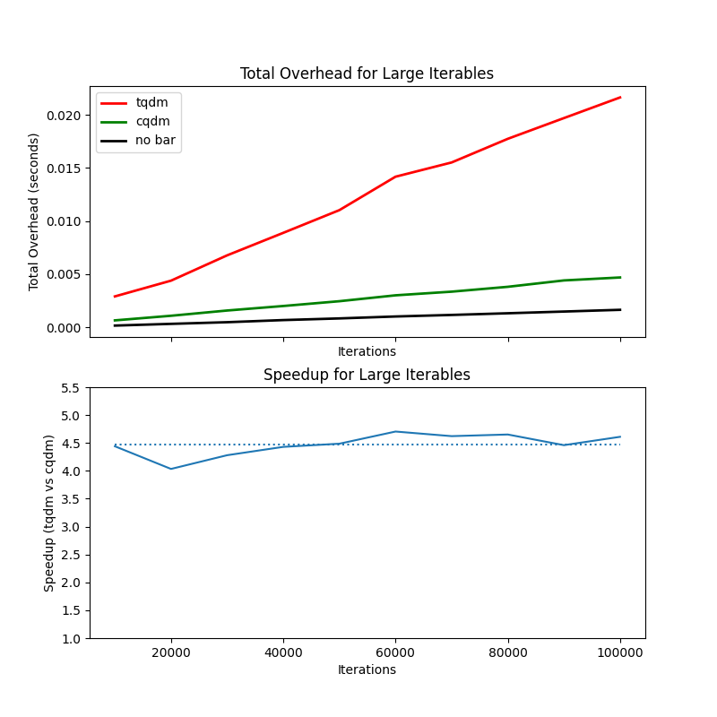

# cqdm

A drop-in replacement for the popular [tqdm library](https://github.com/tqdm/tqdm), accelerated with C bindings.

## Usage

Install with `pip install cqdm`.

Replace usages of `tqdm.tqdm` with `cqdm.cqdm`. This can be done
succinctly by changing your `import` statement:

```python
# was: from tqdm import tqdm
from cqdm import cqdm as tqdm
```

## Performance


This library has about 1/3 the overhead of standard `tqdm`:



This graph was generated by running `performance.py`.

## Impact

There are over 40 million monthly downloads of `tqdm`. Let's
assume there are 40 million instances of `tqdm` running
every day, each performing 100,000 iterations. This
many iterations has around 0.023 seconds of overhead.
Across 40 million instances, this totals 92,000 seconds
or 9.58 days of overhead, per day. Using a relatively
cheap rate for CPU time on AWS, this equates to around $9
of compute time, per day globally.

Switching to `cqdm` would reduce this overhead by 2/3.
That means, if everyone switched to using `cqdm`,
we could save $6 in CPU time per day, globally.

Of course, this ignores the increased time for installs,
compilation, etc., which is nearly an order of magnitude
greater than the time saved...

## Developing

To develop `cqdm` locally:

1. Create a fresh `venv`
2. Install `tqdm` with `pip install tqdm`
3. Build the C-extension with `python setup.py build`
4. Install it with `python setup.py install`
5. Run the demo with `python demo/demo.py`

### Performance

To generate performance graphs:

1. Install `matplotlib` with `python3 -m pip install matplotlib`
2. If on linux, then it might be necessary to install a gui backend for `plt.show()` to function. Do so with `sudo apt-get install python3-tk`
3. Generate the performance graph with `python performance.py`

## TODO

- Look into Python bytecode (compare `__iter__`s of `cqdm` vs `tqdm`)
- Debugging/profiling C extensions
